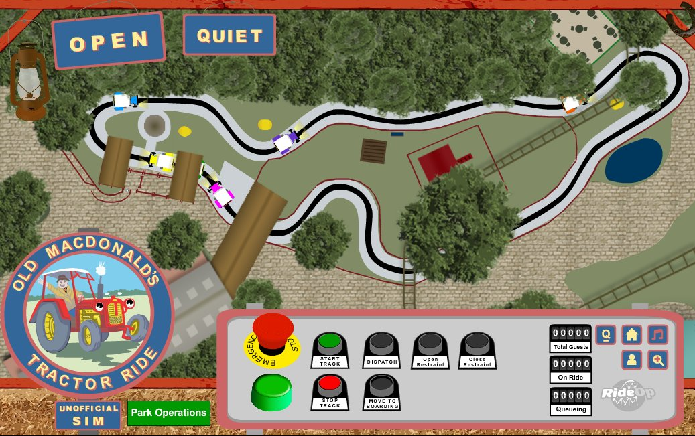
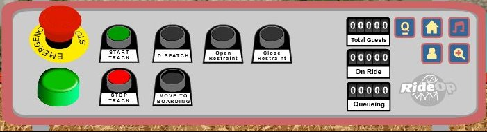

# Old Macdonald’s Tractor Ride Sim

## Overview

I present to you, the unfinished, unofficial ride sim "**Old Macdonald’s Tractor Ride**" which operated until the end of 2013 at the Alton Towers Resort. I'm releasing this unfinished sim with it's source code in the hope that it will offer any budding ride sim creators a starting point. Ride Sims are complicated and time consuming to make. This ride sim was started in 2011, and has never been completed due to various reasons, but mainly lack of time.

The Tractor Ride Sim is made using Adobe Animate CC and published as a flash .swf file, the .fla source code is included.

## Operating Instructions
1. The operator must first turn off the E-Stop to restore power to the ride
2. The operator must press the Start Track button to allow the tractors to move around the ride
3. Dispatch the tractor
4. Hold the Move to Boarding button to move from offload to the boarding position.

**Notes:**

The ride will generate a random number of ride vehicles when started.

 If the operator moves away from the control panel (to another window), the ride will automatically E-Stop.

## Controls

### Ride Controls

| Control          | Keyboard Shortcut |
| ---------------- | ----------------- |
| E-Stop           | Esc               |
| Start Track      | A                 |
| Stop Track       | S                 |
| Dispatch         | Enter             |
| Move to Boarding | Spacebar (Hold)   |
| Open Safety Bar  | Up                |
| Close Safety Bar | Down              |

### Other Controls

| Control                                      | Function                                                |
| -------------------------------------------- | ------------------------------------------------------- |
|  | Toggle to hide or show station buildings                |
|          | Toggle Operator Mode                                    |
|            | Toggle Sound - No sounds have been included in this sim |
|                   | Zoom in or out from the station                         |

## Operating Modes

The ride can operate in two modes, Operator and Host, or Operator Only. Though the real ride hadn't been run with an Operator and Host for many years, the option is still available within this sim.

You can toggle betwean modes using the people icon on the right hand side of the operator panel.

In both modes, the tractor will automatically stop in the offloading section of the station.

### Operator and Host Mode

In Operator and Host mode, the tractor can be unloaded in the offload position. The tractor will not move on unless the boarding part of the station is clear.

### Operator Mode

In Operator Only mode, the tractor cannot be unloaded in the offload position. The tractor will freely move forward from this position by holding the "Move to Boarding" button while a tractor is already in the boarding position.

## TODO
This ride sim is not complete but is in a working condition.

- Speed up Move to Boarding
- Guests - Started but not functional
- Breakdowns
- Chickens

## Further Reading

There are always questions within the community on how to create a ride sim, every single time this question is answered with "by starting with lots of research" and no real helpful answer. 

You can take a look at the blog I started along side this project over at http://tractorridesim.blogspot.com - on there I started by documenting how I got started. Unfortunately, this doesn't go into too much detail, and doesn't cover any of the programming side, but it might be enough, along with this source code to get you started.

## License

Released under MIT

Permission is hereby granted, free of charge, to any person obtaining a copy of this software and associated documentation files (the "Software"), to deal in the Software without restriction, including without limitation the rights to use, copy, modify, merge, publish, distribute, sublicense, and/or sell copies of the Software, and to permit persons to whom the Software is furnished to do so, subject to the following conditions:

The above copyright notice and this permission notice shall be included in all copies or substantial portions of the Software.

THE SOFTWARE IS PROVIDED "AS IS", WITHOUT WARRANTY OF ANY KIND, EXPRESS OR IMPLIED, INCLUDING BUT NOT LIMITED TO THE WARRANTIES OF MERCHANTABILITY, FITNESS FOR A PARTICULAR PURPOSE AND NONINFRINGEMENT. IN NO EVENT SHALL THE AUTHORS OR COPYRIGHT HOLDERS BE LIABLE FOR ANY CLAIM, DAMAGES OR OTHER LIABILITY, WHETHER IN AN ACTION OF CONTRACT, TORT OR OTHERWISE, ARISING FROM, OUT OF OR IN CONNECTION WITH THE SOFTWARE OR THE USE OR OTHER DEALINGS IN THE SOFTWARE.

This ride sim is not endorsed by Merlin Entertainment or the Alton Towers Resort. Old Macdonald’s Tractor Ride name and logo copyright Merlin Entertainment. If you represent either company and would like branding removed please get in touch.`
